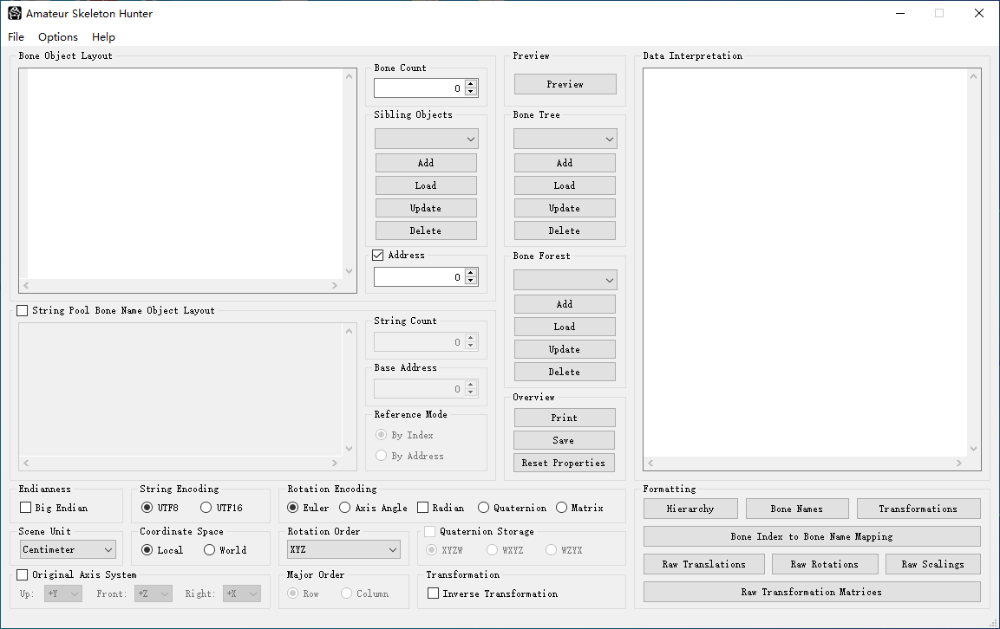

# Introduction
Amateur Skeleton Hunter, abbreviated ASH, is a helper tool designed for cosy examination on skeleton formats with as less coding work as possible. It provides a text-based C-like struct definition interface using only a handful of pre-defined variables, along with other GUI-based options for how to interpret the read data, allowing to describe different formats in a concise yet flexible way. 

# Main Features
1. Support for parsing skeleton related data of all sorts of data types;
2. Ability to handle variant-length data structures via the "length" and the "skip" variables coulped with optional evaluation statements;
3. Support for common arithmetic, logical and bit operations on the "length" variable;
4. Support for serial evaluation statements under a specified condition via the "scope" variable;
5. Formatting operations for debugging raw/converted transformation info, name mapping and bone hierarchy;
6. Visualization of skeletons;
7. Export of the skeletons either as the FBX format, or as an exchange node dump that can be loaded by AXE.

# System Requirement
Windows XP, Windows 7, Windows 8 or Windows 10 with Microsoft Visual C++ 2015 Redistributable (x86) or newer versions installed.
